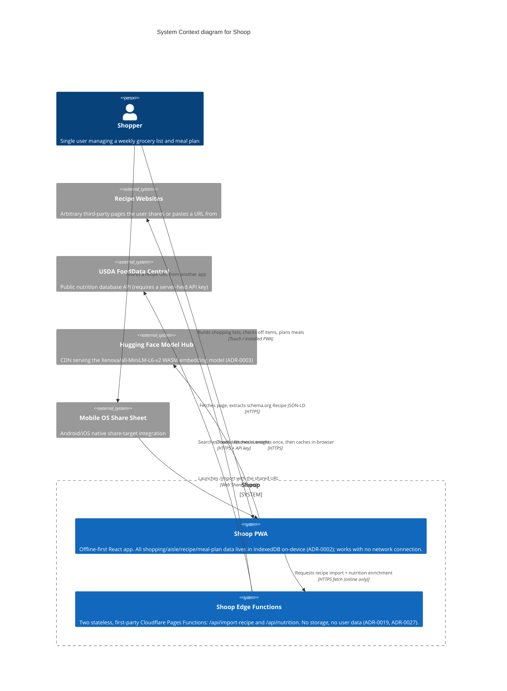

# System Context Diagram

A C4 **Level 1 (System Context)** view of Shoop: the user, the Shoop system boundary, and
every external system Shoop talks to across the network. It intentionally omits internal
structure (IndexedDB, Zustand, Web Workers, React components) — that belongs in a future
Level 2 container diagram.

## Scope

- **Included:** everything currently shipped, plus the Eat tab's nutrition sourcing
  (USDA FoodData Central via `/api/nutrition`), since that feature is implemented and only
  has polish items left in the backlog.
- **Excluded:** CI/CD (GitHub Actions, Cloudflare Pages deploy pipeline — a build-time
  concern, not a runtime dependency) and the not-yet-built iOS Capacitor wrapper
  (`tasks/backlog--ios-capacitor-app.md`).

## Diagram

## Notes

- **Shoop system boundary** spans both the client PWA and its two edge functions because
  they're first-party, same-repo, same-deploy (ADR-0010/ADR-0018) — there's no separate
  ownership or trust boundary between them, unlike the true external systems below.
- **Offline-first is the default state, not an exception.** Every `Rel` crossing out of the
  Shoop boundary is best-effort and degrades gracefully when offline: recipe import falls
  back to manual paste, nutrition enrichment shows a "needs connection" state for
  never-cached ingredients, and the embedding model works entirely from cache after its
  first download. The core shopping/check-off loop (ADR-0001) never depends on any of
  these external systems.
- **Mobile OS Share Sheet** is the platform's native share integration (`share_target` in
  the PWA manifest, `vite.config.ts`), not a system Shoop's team builds or maintains — shown
  external for that reason, distinct from the truly third-party systems.
- Relevant ADRs: 0001 (single-repo offline-first architecture), 0002 (IndexedDB), 0003
  (Hugging Face Transformers), 0019 (recipe-import proxy), 0026/0027 (Eat data model and
  nutrition source).
